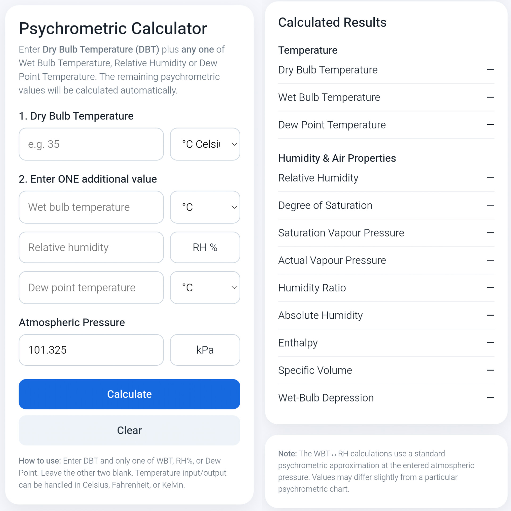

# **Psychrometric Calculator**

 

 

**A simple web-based Psychrometric Calculator for calculating humidity and related properties of air using DBT, WBT, RH, and DPT values.**
 
Dry Bulb Temperature (DBT) and any one of Wet Bulb Temperature, Relative Humidity or Dew Point Temperature is required. The remaining psychrometric values will be calculated automatically.
 
**Features**
 
- Calculate Relative Humidity (RH)
- Calculate Dew Point Temperature (DPT)
- Calculate Wet Bulb Temperature (WBT)
- Support for °C, °F, and K
- Simple and user-friendly interface
 
 

## **Live Demo** 

**"Psychrometric Calculator" (https://iamrudrajit.github.io/psychrometriccalculator/)**
 
 
**Purpose**

This project is created for educational and practical use in understanding the psychrometric properties for Pharmaceutical Applications

## Preview

